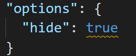

# VSCode Tasks View

Tasks from the *.vscode/task.json* file of the current workspace directory are listed in a vscode view.
You can then execute these tasks, by clicking on the run button of the task.  
Note: Currently only *shell* tasks are supported by this extension.

## Tasks.json

Your shell tasks for C/C++/Python etc. in the *tasks.json* file.

## Tasks View

The labels (names) of your shell tasks are then listed in a vscode view.

## Hiding Tasks

You can hide tasks from the view by setting the following entry in the tasks.json file.

